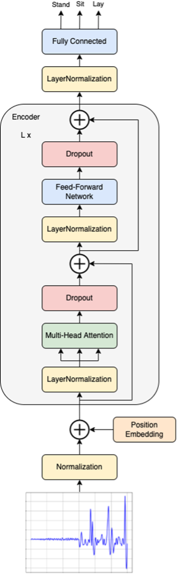
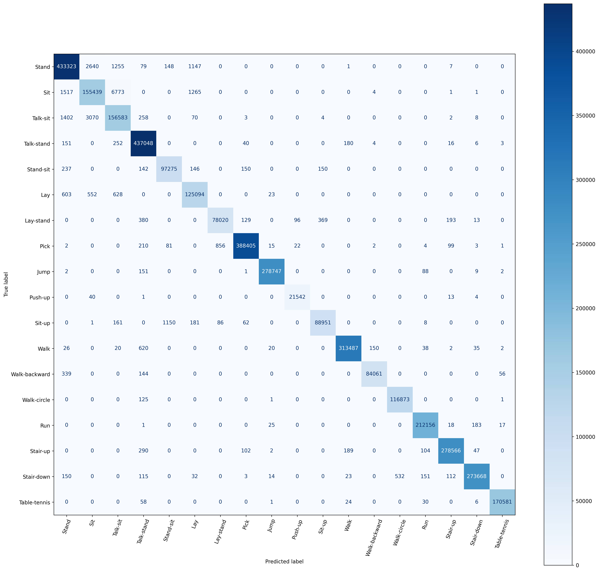

# HAR Transformer
Transformer for Human Activity Recognition

Please check our paper [Wearable Sensor-Based Human Activity Recognition with Transformer Model](https://www.mdpi.com/1424-8220/22/5/1911) for more details.

## Papers
  * Sikder, N.; Nahid, A.A.; KU-HAR: An open dataset for heterogeneous human activity recognition. Pattern Recognition Letters 2021, 146, 46-54, DOI: 10.1016/j.patrec.2021.02.024.
  * Vaswani, A.; Shazeer, N.; Parmar, N.; Uszkoreit, J.; Jones, L.; Gomez, A.N.; Kaiser, Ł.; Polosukhin, I. Attention is all you need. Advances in neural information processing systems 2017, 30.
  * Dosovitskiy, A.; Beyer, L.; Kolesnikov, A.; Weissenborn, D.; Zhai, X.; Unterthiner, T.; Dehghani, M.; Minderer, M.; Heigold, G.; Gelly, S.; Uszkoreit, J. An image is worth 16x16 words: Transformers for image recognition at scale. 2020, arXiv preprint arXiv:2010.11929.
  * Bao, H.; Dong, L.; Wei, F. Beit: Bert pre-training of image transformers. 2021, arXiv preprint arXiv:2106.08254.

## Description

The Transformer for Human Activity Recognition operates in sequence-to-sequence mode and predicts the class for each time series feature. The advantage is that if there are several consecutive classes in one time series, these classes can be easily identified, and the transformer is not limited to the features in the whole time series belonging to one class. 

## Dataset

[KU-HAR](https://www.kaggle.com/datasets/niloy333/kuhar?resource=download)

## Model

  

## Results

  <b>Confusion matrix</b>
  

  <b>Hyperparameters</b>
  

----------------------------------

**Frameworks:** TensorFlow, NumPy, Pandas, Scikit-learn, WanDB
